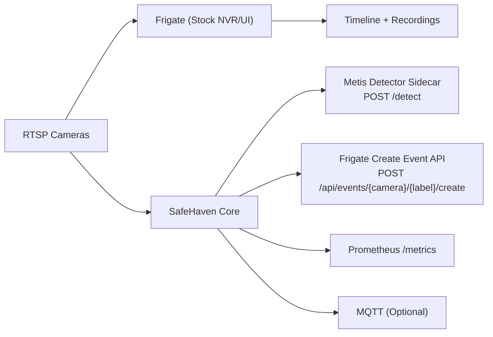

# SafeHaven v2

Offline-first, privacy-first home security focused on **entry-point state semantics**.

SafeHaven v2 combines:
- **Metis-first inference** (Axelera Metis M.2) for real-time local intelligence
- **Frigate (stock)** for NVR recording and timeline UI
- **Semantic state engine** for garage/gate/latch behavior and left-open risk alerts

It is designed so families never have to wonder: *"Did I close the garage door?"*

## Why SafeHaven

Nearly 30% of home break-ins are associated with unlocked doors or open garages. Traditional motion-only systems miss the core risk when a door/gate is left open without motion.

SafeHaven addresses this with continuous local state reasoning:
- Garage: `open/closed` + `left_open`
- Gate: `ajar/closed` + optional `left_open`
- Latch: `locked/unlocked`

All intelligence remains local and works without internet connectivity.

## Core Value Proposition

- **Peace of mind:** deterministic state alerts for critical entry points
- **Privacy by design:** no cloud dependency required
- **Operational reliability:** bounded queues, stale-frame drop, metrics-driven observability
- **No Frigate fork:** integrates via official Frigate Create Event API and plugin model

## Feature Matrix

| Area | Feature | How it works |
|---|---|---|
| Door/Backyard Security | Suspicious activity detection (extensible) | Supports adding person/keypoint/motion-vector monitors through SafeHaven monitor plugins |
| Garage Monitoring | Open/close state semantics | ROI sampling + Metis inference + debounced state machine + left-open timer |
| Local Intelligence | Offline inference | Metis sidecar runs fully on local network with no cloud requirement |
| Smart Alerts | Real-time local notifications | Semantic events are pushed to Frigate timeline; optional MQTT/local actuator hooks |
| Fail-safe Control | Auto-close / lock (optional) | Relay workflows can be triggered after confidence + safety gating |

## Production Architecture



## Repository Layout

```text
safehaven_v2/
  docker-compose.yml
  .env.example
  metis-detector/
  safehaven-core/
  frigate-metis-plugin/
  docs/
```

## Quickstart

### 1) Prepare environment

```bash
cp .env.example .env
```

### 2) Start stack

```bash
docker compose up --build
```

### 3) Validate services

- SafeHaven metrics:
```bash
curl http://localhost:9108/metrics | head
```
- SafeHaven health/readiness:
```bash
curl http://localhost:9109/healthz
curl http://localhost:9109/readyz
```
- Metis detector health:
```bash
curl http://localhost:8090/healthz
curl http://localhost:8090/readyz
```

### 4) Validate Frigate semantic event calls

- Watch `safehaven-core` logs for successful calls to:
  - `POST /api/events/{camera}/{label}/create`

## Local Validation Without Frigate

Run a local integration validation with:
- mocked Frigate Create Event endpoint
- mock Metis detections (`MOCK=1`)
- generated synthetic video source

```bash
make demo-mock
```

Expected result:
- mock Frigate logs show `POST /api/events/.../create`
- semantic transitions and left-open events are emitted

## Frigate Metis Detector Plugin

SafeHaven includes a Frigate detector plugin implemented as a single Python module:
- `frigate-metis-plugin/metis_http.py`

It can be bind-mounted into Frigate plugins path and configured as detector `type: metis`.

## Observability

Prometheus metrics exposed by SafeHaven core:
- `safehaven_infer_ms` (histogram)
- `safehaven_e2e_ms` (histogram)
- `safehaven_queue_depth` (gauge)
- `safehaven_dropped_samples` (counter)
- `safehaven_semantic_events` (counter)

## Security and Privacy Notes

- Offline-first by default
- Local-only video and inference pipeline
- No cloud dependency for core semantics
- Frigate remains stock for maintainability and upgrades

## Deployment Notes

- Python 3.10+ across modules
- Containerized services for repeatable deployment
- Runtime hardening in compose:
  - non-root app containers (`safehaven-core`, `metis-detector`)
  - read-only rootfs + `/tmp` tmpfs for app services
  - dropped Linux capabilities + `no-new-privileges`
  - health checks and startup dependency gating
  - log rotation via Docker `json-file` driver
- Recommended for production:
  - pin camera stream credentials via secrets manager
  - isolate IoT VLAN / local firewall rules
  - configure persistent volumes for Frigate media
  - route `/metrics` into local Prometheus + Grafana
  - replace mutable image tags with immutable digests in `.env` (`FRIGATE_IMAGE`, `MOSQUITTO_IMAGE`)

## Documentation

- [Architecture Overview](docs/ARCHITECTURE_V2.md)
- [SafeHaven Core](safehaven-core/README.md)
- [Metis Detector](metis-detector/README.md)
- [Frigate Plugin](frigate-metis-plugin/README.md)

## Roadmap

- Hardware relay guardrails and safe actuation profiles
- Multi-monitor plugin pack (package/stove/pet/window)
- HA-native dashboard and policy workflows
- Soak-test benchmark report (p95 latency + drop stats)
